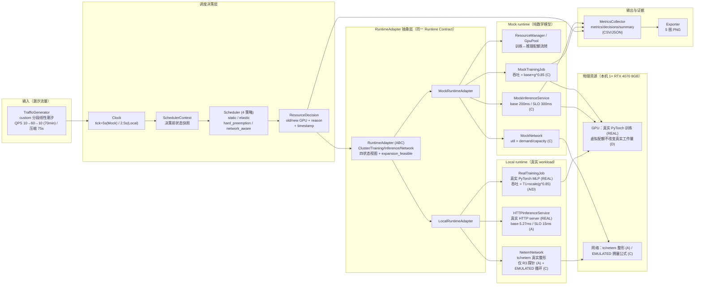

# 最终架构图（Phase 3.3 T8）

> 分层：**Traffic Generator → Scheduler → RuntimeAdapter → (Mock | Local) → 物理/模型资源**。
> 数据标签（见 [`evidence_matrix.md`](evidence_matrix.md)）：MOCK 纯模型 / REAL 实测 / EMULATED 缩放。



## ASCII 等价图（无渲染环境兜底）

```
                        潮汐流量 TrafficGenerator（QPS 时间表）
                                     │
                                     ▼
   ┌──────────────────────── 调度决策层 ───────────────────────┐
   │  Clock → SchedulerContext（决策前快照）→ Scheduler.step    │
   │          4 策略：static / elastic / hard_preemption /     │
   │                    network_aware                          │
   │              → ResourceDecision（配额变化 + reason）       │
   └───────────────────────────┬──────────────────────────────┘
                               │ 同一 Runtime Contract
                               ▼
   ┌────────────── RuntimeAdapter（ABC）───────────────┐
   │  Cluster / Training / Inference / Network 状态视图 │
   │  network_expansion_feasible（§17 闸门）            │
   └──────┬──────────────────────────┬────────────────┘
          │ mode="mock"              │ mode="local"
          ▼                          ▼
   ┌──────────────┐          ┌────────────────────┐
   │ MockRuntime  │          │ LocalRuntime       │
   ├──────────────┤          ├────────────────────┤
   │ ResourceMgr  │          │ RealTrainingJob    │──→ GPU：真实 PyTorch (REAL)
   │ MockTraining │          │   T1×g^0.85 (A/D)  │
   │ MockInference│          │ HTTPInference      │
   │ MockNetwork  │          │   base 5.27ms (A)  │
   └──────────────┘          │ NetemNetwork       │──→ NIC：tc/netem (A) / EMULATED (C)
                             └────────────────────┘
                          │
                          ▼
          MetricsCollector（metrics/decisions/summary）
                          │
                          ▼
          Exporter（traffic/gpu_alloc/p95/training_throughput/network 5 图）
```

## 关键数据流（每 tick）

1. **TG 产出 QPS** → `runtime.advance(qps)`：网络刷新 + 推理推进（网络先于推理）。
2. **决策前快照** → `SchedulerContext`（调度器看"决策前"的集群）。
3. **Scheduler.step(ctx)** → `ResourceDecision`（4 策略之一；network_aware 经闸门
   `network_expansion_feasible` 决定放行/拦截）。
4. **apply_resource_decision**：配额流转（Mock：ResourceManager shift；Local：虚拟配额）+
   workload 同步。
5. **advance_training**：训练推进（Mock：幂律 + 网络回压；Local：真实 PyTorch 跑 tick 秒，
   上报 EMULATED 吞吐）。
6. **collector 采集决策后指标** + 记录决策 → CSV/JSON → 5 图。

## 分层职责与诚实边界

| 层 | 职责 | 证据等级 |
|---|---|---|
| 输入 | 潮汐 QPS（确定性 RNG，seed 42） | C（模型）+ 可控 |
| 调度 | 决策策略（4 策略） | 代码真实执行；决策跨 runtime 一致（B） |
| RuntimeAdapter | 统一契约，解耦 Scheduler 与资源实现 | 契约本身 A（代码事实） |
| Mock 资源 | 数学建模 | C |
| Local 资源 | 真实 PyTorch / HTTP / netem | 单卡训练/推理延迟 A；**多卡缩放 D** |
| 物理 | 1 张 RTX 4070 8GB | 唯一物理资源；**g>1 全部 EMULATED/D** |

> **一句话**：上层（输入→调度→契约）是"行为可复现的真实代码"，下层（资源）在 Mock 是纯模型
> （C）、在 Local 是"真实单卡（A）× EMULATED 多卡（D）"。本图不把任何 D 画成 A。
